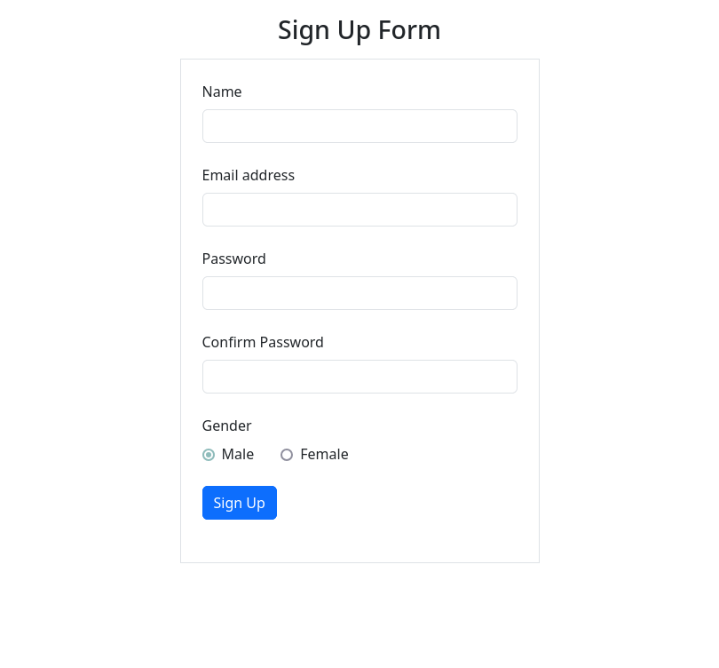
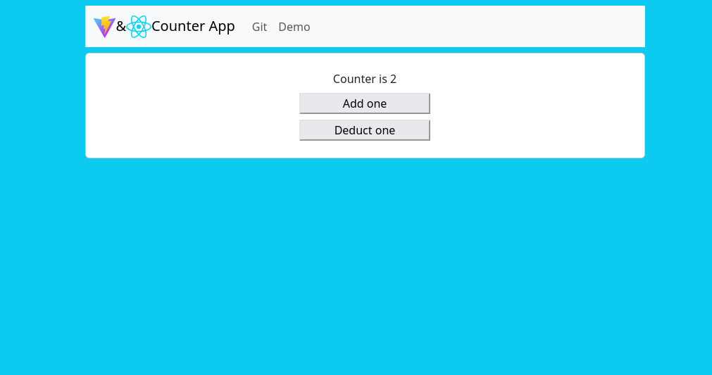
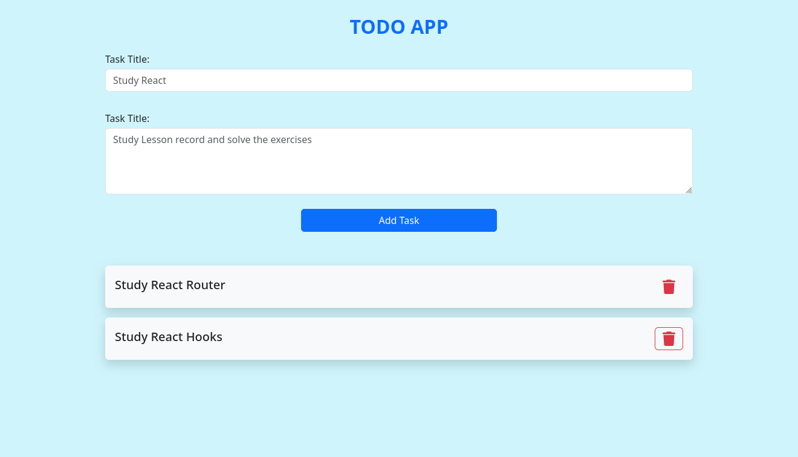
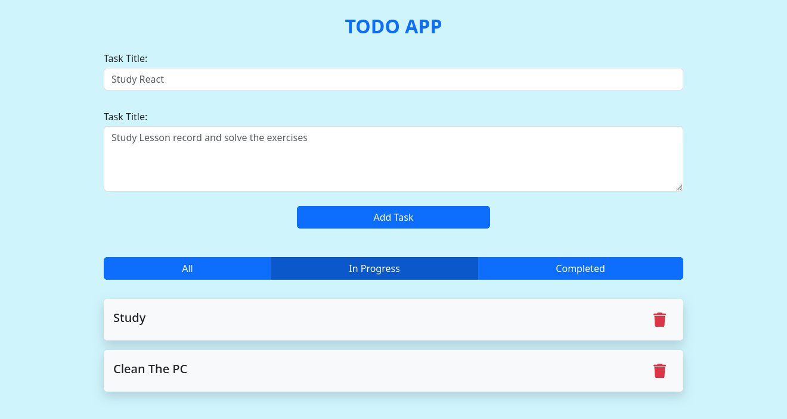
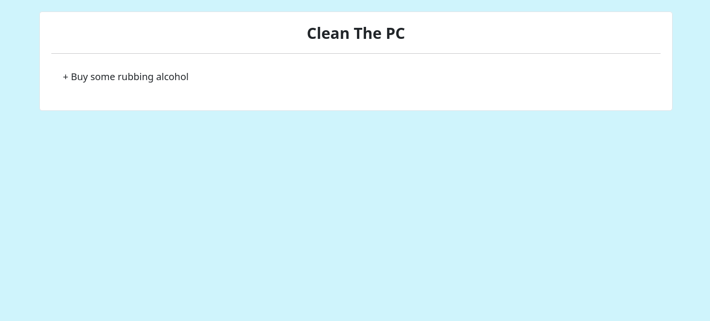

# React Labs for ITI

## Lab 1: React Sign Up From

  

## Lab 2: Counter App with React

  

## Lab 3: Todo App with React

  

## Lab 4: Enhanced Todo App with React

  <a href="./04-LabFour/todo-app-v1.2/">
    
     
    
  </a>

